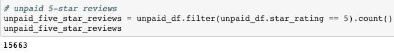

# Amazon_Vine_Analysis

## Overview
From this challenge, analysis on Amazon reviews written by members of the paid Amazon Vine program was done. The Amazon Vine program is a service that allows manufacturers and publishers to receive reviews for their products.  Companies like SellBy pay a small fee to Amazon and proivde products to Amazon Vine members, who are then required to publsih a review.

Data was analyzed by using PySpark to perform the ETL process to extract the dataset, transform the data, connect to an AWS RDS instance, and load the transformed data into pgAdmin. Lastly, PySpark was used again to determine if there is any bias toward favorable reviews from the Vine members in the dataset.

## Results
- How many Vine reviews and non-Vine reviews were there?

There were total of 94 Vine reviews.
### 

There were teotal of 40,471 non-Vine reviews.
### 

- How many Vine reviews were 5 stars? How many non-Vine reviews were 5 stars?

There were total of 48 Vine reviews that were 5 stars.
### 

There were total of 15,553 non-Vine reivews that were 5 stars.
### 

- What percentage of Vine reviews were 5 stars? What percentage of non-Vine reivews were 5 stars?

Approximately 51% of Vine reviews were 5 stars.
### 

Approximately 39% of non-Vine reivews were 5 stars.
### 
